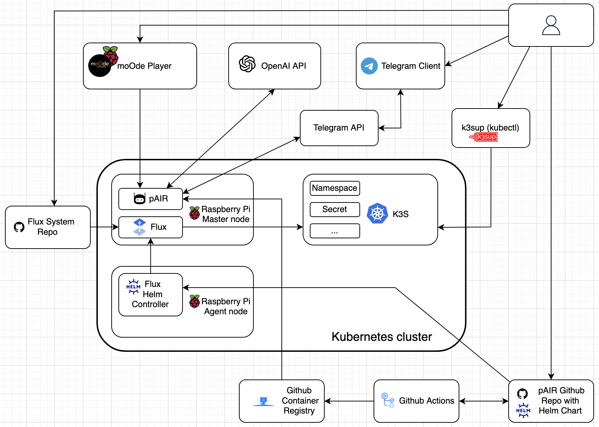
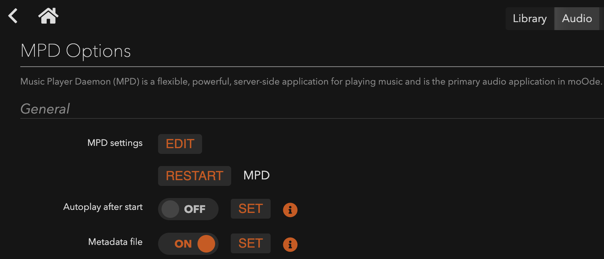
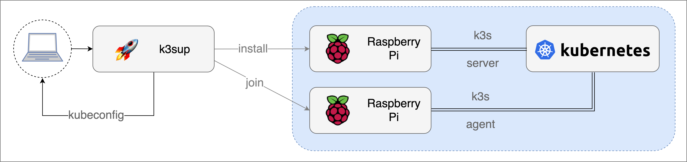
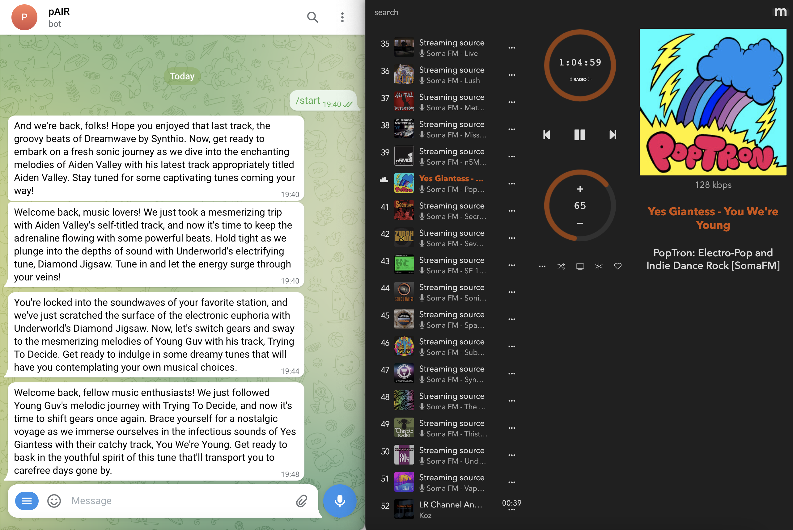
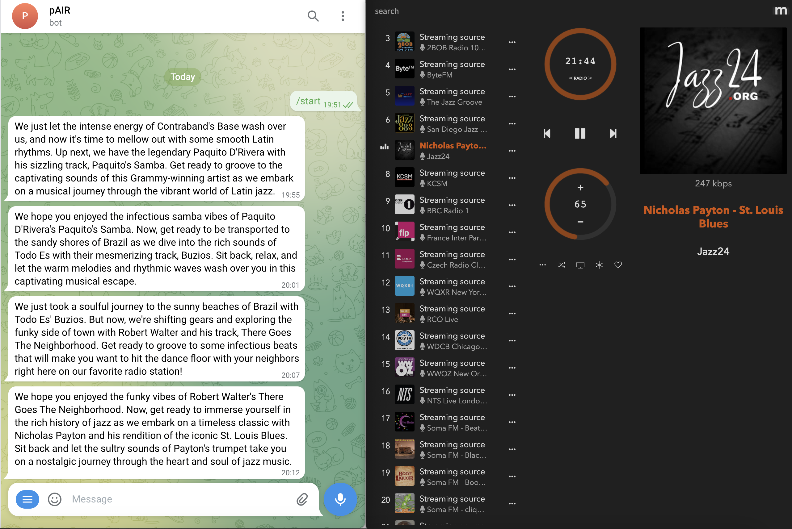
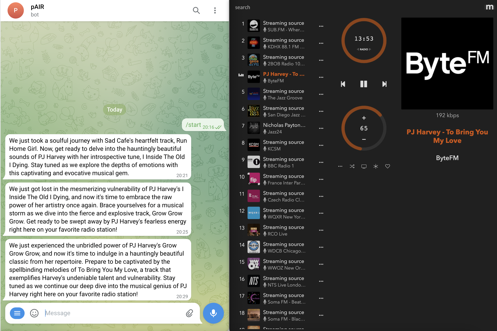
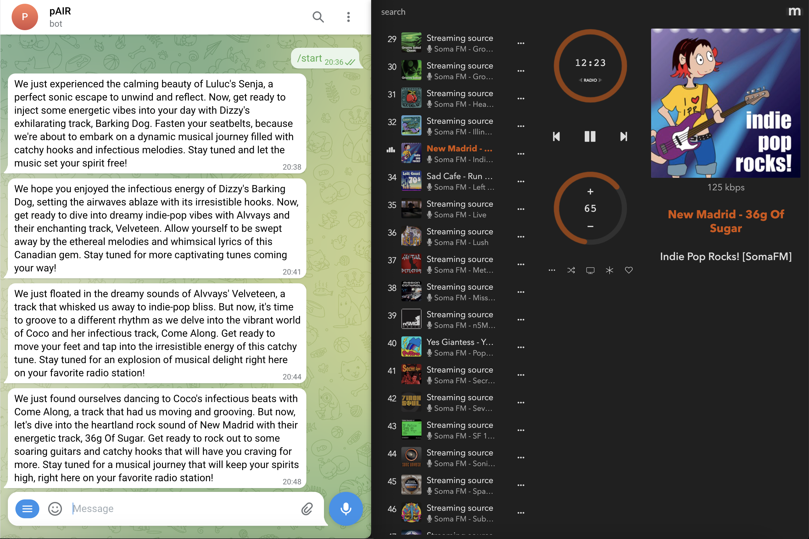

# personal AI Radio


## Contents
- [What is this project about?](#what-is-this-project-about)
- [Project goals](#project-goals)
- [Project essence](#project-essence)
- [Applied technologies](#applied-technologies)
- [Used developments and know-how](#used-developments-and-authors-know-how)
- [Hardware list](#hardware-list)
- [Installation](#installation)
- [Demo](#demo)
- [Conclusions and future improvements](#conclusions-and-future-improvements)

## What is this project about

This work is an experimental creative PET project completed as part of the Basics of DevOps and Kubernetes course by Prometheus.

## Project goals

- Gain practical skills in applying the technologies and tools learned during the course.
- Create a completed working prototype of a software product and an integrated system that addresses a potentially in-demand user function.
- Implement the GitOps methodology (i.e. versioning the infrastructure in Git) and automate infrastructure and deployment management in Kubernetes using Flux.
- Another important goal was to have fun using Raspberry Pi microcomputers 🙂

## Project Essence

The core of the project is a Telegram bot that receives information about the currently playing music tracks, sends a request to the OpenAI API and returns the introduction for the new track, imitating the work of a radio DJ.  
By introduction, I mean the text that the DJ says as an announcement of the upcoming song that will be played on the air.  
In this project, introduction texts are received as messages from the Telegram bot.  
The bot operates automatically once it is launched.  
In the current implementation, the Telegram bot runs as a container deployed in a k3s cluster hosted on two Raspberry Pi microcomputers. The media player is installed on a third Raspberry Pi and is used to provide information and play tracks.  
The tools used may be overkill for this project, but this was done intentionally to gain tooling skills and to test the project's scalability in the future.  

## Applied Technologies

This project was implemented using the following approaches and tools:

### Telegram Bot:
- Golang
- GitHub
- OpenAI API "gpt-3.5-turbo" model

### Kubernetes:
- k3s
- k3sup
- Secrets

### GitOps:
- GitHub Actions
- GitHub repository secrets
- GitHub Container Registry
- Helm charts
- FluxCD

### Raspberry Pi:
- Raspberry Pi Imager
- moOde Audio Player
- SSH

### System Context Diagram



## Used developments and author's know-how

As part of the preparation for the project, an analysis was made of existing implementations of the integration of the Telegram bot with ChatGPT (OpenAI API).  
The project on GitHub was chosen as the basis for the modification: https://github.com/leafduo/chatgpt-telegram-bot  
The author's know-how is the integration of the selected Telegram bot with the popular moOde Audio player and OpenAI API.  

## Hardware list

This is the list of hardware I used to implement the project in my home lab:
- Raspberry Pi 4 Model B 4GB RAM (master node)
- Raspberry Pi 3 Model B+ 1GB RAM (agent node)
- Raspberry Pi 3 Model A+ 512MB RAM with PCM5122 DAC HAT (moOde audio player)

## Installation

### Raspberry Pi

- Download the official [Raspberry Pi Imager](https://www.raspberrypi.org/documentation/installation/installing-images/)
- Flash two SD cards using Raspberry Pi OS Lite 64-bit to be used to set up the cluster.  
  Important: Enable SSH in Imager settings.  
  Important: Change IP and hostname for each Raspberry  
- Flash an SD card using moOde Audio Player image.
- Generate an ssh-key if you don't already have one with ssh-keygen (hit enter to all questions)
- Power-up the devices
- Log into the first Raspberry Pi and do the following:
```sh
sudo ssh pi@ip_of_your_raspberry
# Enable container features
sudo sed -ie 's/$/ cgroup_enable=cpuset cgroup_memory=1 cgroup_enable=memory/' /boot/cmdline.txt
sudo sed -ie "/gpu_mem/c\gpu_mem=16" /boot/config.txt
# And then reboot so our changes take effects
sudo reboot
```
- Add your ssh key so we will easily ssh into RPs later
```sh
sudo ssh-copy-id pi@ip_of_your_raspberry
```
- Repeat this for the second Raspberry node
- Login into moOde Audio Player: (http://moode), moode.local or IP_ADDRESS
- Setup audio devices and services if necessary
- Turn on the Metadata file via Audio Config in the MPD Options section



Note: Song info is via the command get_currentsong which returns the contents
   of the Metadata file /var/local/www/currentsong.txt encoded as JSON

### k3s and k3sup

[k3sup](https://github.com/alexellis/k3sup) is a light-weight utility to get from zero to KUBECONFIG with k3s on any local or remote VM



- Download and install k3sup (this should be done on your laptop/pc):
```sh
curl -sLS https://get.k3sup.dev | sh
# sudo install k3sup /usr/local/bin/
k3sup --help
```
- Bootstrap of k3s onto Raspberry Pi with k3sup
```sh
k3sup install --ip $SERVER_IP --user pi --no-extras
```
- Point at the config file and get the status of the node:
```sh
export KUBECONFIG=`pwd`/kubeconfig
kubectl get node -o wide
```
- Now you have kubectl access from your laptop to your Raspberry Pi running k3s
- Join the agent node: 
```sh
k3sup join --ip $IP --server-ip $SERVER_IP --user pi
```
- Now check kubectl get node:
```sh
kubectl get node
NAME   STATUS   ROLES                  AGE     VERSION
rpi4   Ready    control-plane,master   10m     v1.27.3+k3s1
rpi3   Ready    <none>                 3m21s   v1.27.3+k3s1
```
### Flux

- Install the Flux CLI
```sh
curl -s https://fluxcd.io/install.sh | sudo bash
```
- Run flux check
```sh
flux check --pre
► checking prerequisites
✔ Kubernetes 1.27.3+k3s1 >=1.24.0-0
✔ prerequisites checks passed
```
- Generate a GitHub personal access token (PAT) that can create repositories by checking all permissions under repo
- Install Flux on a Kubernetes cluster using the flux bootstrap command
```sh
# Export your GitHub personal access token as an environment variable:
export GITHUB_TOKEN=<your-token>
# Run the bootstrap for a repository on your personal GitHub account:
  flux bootstrap github \ 
  --owner=my-github-username \
  --repository=pair-flux-system \
  --path=clusters \
  --personal
```
- Now check kubectl get pod
```sh
kubectl get po -o wide -A      
NAMESPACE     NAME                                      READY   STATUS    RESTARTS   AGE    IP          NODE   NOMINATED NODE   READINESS GATES
kube-system   local-path-provisioner-957fdf8bc-9kxtf    1/1     Running   0          19m    10.42.0.2   rpi4   <none>           <none>
kube-system   coredns-77ccd57875-4zckk                  1/1     Running   0          19m    10.42.0.4   rpi4   <none>           <none>
kube-system   metrics-server-648b5df564-hhqlz           1/1     Running   0          19m    10.42.0.3   rpi4   <none>           <none>
flux-system   kustomize-controller-c89454b89-qmbpr      1/1     Running   0          2m5s   10.42.0.5   rpi4   <none>           <none>
flux-system   source-controller-5f7b998fc9-vzn8m        1/1     Running   0          2m5s   10.42.0.6   rpi4   <none>           <none>
flux-system   notification-controller-b7d8566b7-kklql   1/1     Running   0          2m5s   10.42.1.3   rpi3   <none>           <none>
flux-system   helm-controller-74b5f87d94-4g9q2          1/1     Running   0          2m5s   10.42.1.2   rpi3   <none>           <none>
```

### Deploy pAIR

- Get your OpenAI API key  
  You can create an account on the OpenAI website and [generate your API key](https://platform.openai.com/account/api-keys).  
- Get your telegram bot token
  Create a bot from Telegram [@BotFather](https://t.me/BotFather) and obtain an access token.
- Create your own Github copy of the pAIR repository, which will be the only source of truth for implementing the GitOps method.
- Clone your private Github repository of the pair-flux system we created earlier.
- Add and commit the following yaml files in it which you can find in the current project repository:  
  ./clusters/flux-system/pair-gr.yaml  
  ./clusters/flux-system/pair-hr.yaml  
  ./clusters/flux-system/pair/pair-ns.yaml  
  ./clusters/flux-system/pair/pair-secret.yaml  
- Update kustomization.yaml by adding these yaml files. It will look like this:

```sh
  apiVersion: kustomize.config.k8s.io/v1beta1
  kind: Kustomization
  resources:
  - gotk-components.yaml
  - gotk-sync.yaml
  - pair-gr.yaml
  - pair-hr.yaml
  - ./pair/pair-ns.yaml
  - ./pair/pair-secret.yaml
  ```
- Update the URL in pair-gr.yaml with the pAIR repo.
- Three variables are required to run pAIR. The following two can be stored in the secret: TELEGRAM_APITOKEN and OPENAI_API_KEY
- Encrypt both values to base64 and add to ./pair/pair-secret.yaml. Or create the secret manually.  
  Important: Do not store tokens in a public repository  
- Another required variable is the URL of the third Raspberry Pi with moOde installed. Set MOODE_BASE_URL in ./helm/values.yaml
- Flux is triggered when the Chart Version is changed in the ./helm/Chart.yaml. As soon as you increase the chart version and commit, the Flux system will start reconciling the Kubernetes infrastructure entities.  
  Important: Make sure the container repository is public  
- Flux will create a pAIR deployment set and a coresponding pod

```sh
kubectl get deploy -n pair         
NAME   READY   UP-TO-DATE   AVAILABLE   AGE
pair   1/1     1            1           56m

kubectl get po -n pair    
NAME                    READY   STATUS    RESTARTS   AGE
pair-846dcd4cb6-hvmsj   1/1     Running   0          3m21s

```
- If the pAIR pod is up and runnig, then the bot is ready to go.
- Turn on the music in the moOde player and select "Start a new chat" in the bot menu.
- The bot will start generaiting introductions, acting as a radio DJ.
- To stop generating messages, just stop playing the tracks.

## Demo

Here you can find some screenshots that show how pAIR works.  
Random internet radio stations built into moOde streaming music and the pAIR bot comments on it just like a radio DJ, isn't it?







## Conclusions and Future Improvements

- The project has been successfully implemented.
- Telegram bot works reliably and performs its functions.
- It was possible to make sure in practice that the applied stack of technologies and tools can be successfully used for similar projects, at least in a home lab. It is also possible to scale the project in case of implementing additional functionality, which leads to an increase in the load and to an increase in the requirements for fault tolerance.
- The practical application of the GitOps methodology was successful, greatly simplifying the deployment of new versions of the bot.
- The potential for integration with the OpenAI API has been explored.
- And of course, as planned, it was really fun to implement the concept of integrating RPi + Telegram bot + OpenAI + music 🙂

 An interesting fact is that the code has been modified with the patient support of ChatGPT (although it also took some patience for the author to try out the various proposed functions and integrate them into the code).

An example of further development of this project could be the implementation of the following additional features:
- Add more user commands
- Analyze the history of played tracks using the OpenAI API and providing recommendations for similar artists or tracks based on this history. Similar functionality is available on streaming services, but this approach allows for more customized and personalized requests.
- Generation of text based on the history of the played tracks. For example, the history of the group, interesting facts about the bio of performers, track ratings, etc.
